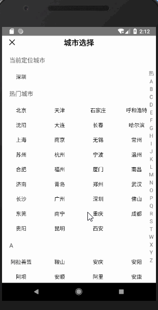

### 引言
使用RN开发了一段时间,最近遇到了一个比较棘手的问题,就是用react写个城市选择列表,当然这个如果用Android原生来写,网上的例子数不胜数,随便就能找到,但是react却很少,也没有一个和我这个需求相匹配的,所以就只能自己动手撸一个出来咯.
### 效果
这个城市列表和其他的有点区别
>1,有当前定位城市
>2,有热门城市
>3,每个子项是一个类似GridView的效果,而不是ListView
实现的效果图如下:

### 实现步骤
* 首先需要一个city.json的json文件
例:
```
{
    "key": "A",
    "data": [{
      "citys": [
        {
          "city": "阿拉善盟",
          "id": 152900
        },
        {
          "city": "鞍山",
          "id": 210300
        },
        {
          "city": "安庆",
          "id": 340800
        },
        {
          "city": "安阳",
          "id": 410500
        },

  .....]
  }
```

* 整个列表采用sectionList
SectionList提供了粘性的header,设置为true即可`stickySectionHeadersEnabled=true`,这样在滚动的时候就有实现了粘性效果;

代码如下:

```
					<SectionList
                        ref="sectionList"
                        renderSectionHeader={this.renderSectionHeader}
                        renderItem={this.renderItem}
                        stickySectionHeadersEnabled={true}
                        showsHorizontalScrollIndicator={false}
                        sections={this.state.sections}
                        keyExtractor={this._extraUniqueKey}
                    />
```
* 右边采用ScrollView来实现,最开始采用View,发现会有事件抢夺问题,具体的原因不祥,毕竟我对RN的事件传递也不是特别熟
代码如下:

```
  /*右侧索引*/
    sectionItemView() {
        const sectionItem = this.state.sections.map((item, index) => {
            if (index === 0) {
                return null
            }
            return <Text key={index}
                         style={
                             [cityStyle.sectionItemStyle,
                                 {backgroundColor: this.state.isTouchDown ? touchDownBGColor : touchUpBGColor}]
                         }>
                {item.key}
            </Text>
        });

        return (
            <ScrollView style={cityStyle.sectionItemViewStyle}
                        ref="sectionItemView"
                        onStartShouldSetResponder={() => true} 
                        onMoveShouldSetResponder={() => true}
                        onResponderTerminationRequest={() => true}
                        onResponderGrant={this.responderGrant}
                        onResponderMove={this.responderMove} 
                        onResponderRelease={this.responderRelease}
            >
                {sectionItem}
            </ScrollView>

        );
    }
```
这里的几个方法需要具体说明一下(React Native手势响应,就和android的onTouchEvent一个意思):
通过实施正确的处理方法，视图可以成为接触响应器。有两种方法来询问视图是否想成为响应器： 
- View.props.onStartShouldSetResponder: (evt) => true,——这个视图是否在触摸开始时想成为响应器？ 
- View.props.onMoveShouldSetResponder: (evt) => true,——当视图不是响应器时，该指令被在视图上移动的触摸调用：这个视图想“声明”触摸响应吗? 
如果视图返回 true 并且想成为响应器，那么下述的情况之一就会发生： 
- View.props.onResponderGrant:(evt)= > { } ——视图现在正在响应触摸事件。这个时候要高亮标明并显示给用户正在发生的事情。 
- View.props.onResponderReject:(evt)= > { }——当前有其他的东西成为响应器并且没有释放它。 
如果视图正在响应，那么可以调用以下处理程序： 
- View.props.onResponderMove:(evt)= > { }——用户正移动他们的手指 
- View.props.onResponderRelease:(evt)= > { }——在触摸最后被引发，即“touchUp” 
- View.props.onResponderTerminationRequest:(evt)= >true——其他的东西想成为响应器。这种视图应该释放应答吗？返回 true 就是允许释放 

事件处理:

```

    /*用户手指开始触摸*/
    responderGrant(event) {
        this.scrollSectionList(event);
        this.setState({
            isTouchDown: true,
        })
    }

    /*用户手指在屏幕上移动手指，没有停下也没有离开*/
    responderMove(event) {
        console.log("responderMove")
        this.scrollSectionList(event);
        this.setState({
            isTouchDown: true,
        })
    }

    /*用户手指离开屏幕*/
    responderRelease(event) {
        console.log("onTouchUp")
        this.setState({
            isTouchDown: false,
        })
    }
 /*手指滑动，触发事件*/
    scrollSectionList(event) {
        const touch = event.nativeEvent.touches[0];
        // 手指滑动范围 从 A-Q  范围从50 到 50 + sectionItemHeight * cities.length
        if (touch.pageY  >= sectionTopBottomHeight+headerHeight+statusHeight
            && touch.pageY <= statusHeight +headerHeight+sectionTopBottomHeight + sectionItemHeight * 25
            && touch.pageX >= width - sectionWidth
            && touch.pageX <= width
        ) {
            console.log("touchx" + touch.pageX + '.=======touchY' + touch.pageY)
            const index = (touch.pageY - sectionTopBottomHeight - headerHeight) / sectionItemHeight;
            console.log("index" + index);
            if (Math.round(index)>=0&&Math.round(index)<=25){
                this.setState({
                    selectText: this.state.sections[Math.round(index)].key
                })
                //默认跳转到 第 index 个section  的第 1 个 item
                this.refs.sectionList.scrollToLocation({
                    animated: true,
                    sectionIndex: Math.round(index),
                    itemIndex: 0,
                    viewOffset: headerHeight
                });
            }

        }
    }
```
这里根据手指在右边索引栏的滑动事件,获取到当前的x轴和y轴的具体值,然后计算出具体的子项目的标题,让SectionList滚动到具体的index位置;
* 子项目列表采用FlatList实现GridView的效果

```
 <FlatList
                    data={info.section.data[0].citys}
                    horizontal={false}
                    numColumns={4}
                    showsHorizontalScrollIndicator={false}
                    renderItem={({item}) => this._createItem(item)}
                    keyExtractor={this._extraUniqueKey2}
                />
```
这样基本大体的效果就实现了

### 最后
React native实现这个有个很坑爹的地方,就是渲染列表会花费很长的时间,Android是这样,ios没试过,所以如果没有渲染完就去滑动索引栏会报这个`scrolltoindex-should-be-used-in-conjunction-with-getitemlayout-or-on`异常,网上找了很多资料,说是SectionList没有渲染完就调用scrollToLocation,如果要在没有渲染完之前调用scrollToLocation需要配合getitemlayout使用,但是这个getitemlayout又需要传入具体item的高度,然而我的FlatList的高度是不确定的,所以就很坑爹了,找不到办法解决,只能延时加载右边索引栏;
代码如下:
```
   componentDidMount() {
        setTimeout(() => {
            this.setState({
                canTouch: true
            })
        }, 1600)
    }
```
这样全部基本就完成了
项目地址:
[https://github.com/mouxuefei/RN-CitySectionList](https://github.com/mouxuefei/RN-CitySectionList)